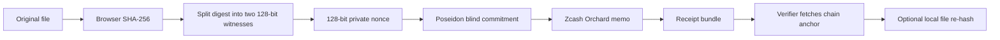

# Architecture

ZecTime separates private file handling from public settlement.



## Components

`apps/web` provides the browser console. It keeps file hashing and local file verification in the client. The API bridge receives commitments, receipts, txids, and proof payloads, but it does not receive original files.

`crates/circuit` defines two Halo2 circuits:

- `timestamp`: proves that a private document hash and nonce open to the public commitment and block height.
- `timestamp_predicate`: proves selective statements over private document fields without revealing the whole document.

`crates/prover` creates timestamp and predicate proofs from typed witnesses.

`crates/verifier` verifies proof bytes against public inputs.

`crates/anchor` defines the Zcash Orchard memo layout and zallet RPC bridge.

`crates/cli` exposes the product workflow:

```bash
zectime timestamp stamp
zectime timestamp reveal
zectime timestamp verify
zectime timestamp anchor
zectime timestamp fetch
zectime timestamp predicate-setup
zectime timestamp predicate-prove
zectime timestamp predicate-verify
```

## Receipt Bundle

The generated bundle is named `zectime-zk-receipt.json` and is designed for user custody.

It contains:

- `txid`
- `network`
- public receipt fields: commitment and block height
- private opening fields: nonce and split SHA-256 digest
- anchor metadata
- document size

The bundle can be shared with a verifier when the owner wants to prove the timestamp. Without the private opening or original file, the public chain commitment is not a reusable file fingerprint.

## API Surface

The main verifier API is:

```text
POST /api/timestamps/fetch
```

It validates:

- chain anchor by txid
- receipt commitment and block height
- optional local document verification when the caller provides the original file in the browser flow

The API intentionally rejects multipart file upload for the fetch endpoint. Original file verification belongs in the browser.
